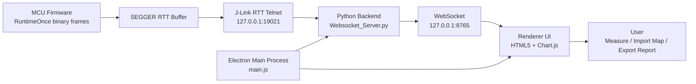

# Runtime Observer

[中文](README.md) | [English](README.en.md)

Runtime Observer is a desktop measurement tool for embedded real-time systems. It collects RuntimeOnce data through SEGGER J-Link RTT and visualizes Task / Runnable execution time and overall CPU load with curves, tables, snapshots, and reports.

It is designed for observing task scheduling behavior, Runnable runtime, CPU load margin, and abnormal runtime fluctuations.

## Overview

Runtime Observer targets runtime observation scenarios in embedded real-time systems. The desktop process starts and manages the Python acquisition backend, J-Link GDB Server, RTT Telnet link, and pushes acquisition data to the frontend through WebSocket.

The frontend provides real-time curves, measurement markers, object statistics, CPU load windows, snapshots, and report export, making it easier to evaluate task or Runnable runtime changes during debugging.

## Features

- Real-time J-Link RTT RuntimeOnce acquisition
- Task / Runnable runtime curve visualization
- Curve zooming, follow-latest mode, reset view, and measurement markers
- Task / Runnable enum mapping import and memory clearing
- CPU load sliding-window analysis
- Startup precheck page with connection steps and backend logs
- Draggable floating receive-log panel
- Snapshot capture and CSV export
- Test report export
- Backend and J-Link process cleanup when the desktop app exits
- Hidden SEGGER J-Link GDB Server startup for a cleaner desktop workflow

## Tech Stack

| Layer | Technology |
| --- | --- |
| Desktop shell | Electron |
| Frontend | HTML5 / CSS / JavaScript |
| Charts | Chart.js |
| Acquisition backend | Python WebSocket |
| Debug link | SEGGER J-Link RTT / J-Link GDB Server |
| Packaging | electron-builder |

## Architecture



## Data Flow

```text
MCU RTT binary frames
  -> J-Link RTT Telnet
  -> Python WebSocket backend
  -> Electron Renderer
  -> Chart.js curves / tables / reports
```

## Development

Install dependencies:

```powershell
npm install
```

Start the desktop app:

```powershell
npm start
```

Build Windows artifacts:

```powershell
npm run dist
```

## Usage

1. Make sure the SEGGER J-Link toolchain is installed locally.
2. Start Runtime Observer.
3. The startup page displays backend, J-Link, RTT, and WebSocket connection steps.
4. After entering the main view, observe Task / Runnable runtime curves and CPU load.
5. Import Task / Runnable mapping files from the menu if object names are needed.
6. Use the memory clearing menu item to restore original object names.

## Notes

- The tool depends on a local SEGGER J-Link environment.
- Mapping memory and layout memory are stored locally by the desktop app.

## Changelog

### V1.1

Release date: 2026-07-06

#### Packaging Runtime Fixes

- Fixed the packaged exe startup error where the frontend HTML file could not be found after `npm run dist`.
- Changed app-bundled assets, such as the frontend HTML and icon, to resolve through `app.getAppPath()` so they work with the `app.asar` package structure.
- Changed backend scripts and executable tools to resolve through `process.resourcesPath`, ensuring external processes can access them in packaged builds.
- Added `backend/` to `electron-builder.extraResources`, so it is copied to `resources/backend/` in packaged output.

#### Version and Release Metadata

- Upgraded the application version from `1.0.0` to `1.1.0`.
- Updated the About dialog version display to `V1.1`.
- Added the V1.1 changelog at the bottom of the GitHub README page, leaving a clear location for future release history.

#### Verification

- `main.js` syntax check passed.
- `preload.js` syntax check passed.
- Frontend HTML inline script syntax check passed.
- `npm run dist` packaging verification passed.
- Confirmed packaged output contains `app.asar`, `resources/backend/Websocket_Server.py`, and `resources/tools/Websocket_Server.exe`.
