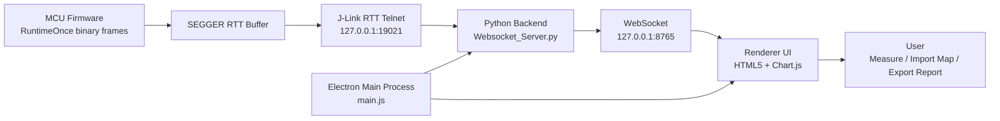

# Runtime Observer

[中文](#中文) | [English](#english)

Runtime Observer is a desktop measurement tool for observing J-Link RTT RuntimeOnce timing and CPU load in embedded systems.

---

## 中文

### 项目简介

Runtime Observer 是一款面向嵌入式实时系统的桌面测量工具，用于通过 SEGGER J-Link RTT 采集 RuntimeOnce 数据，并以曲线、表格、快照和报告的形式观察 Task / Runnable 单次运行时间与 CPU 整体负载。

它适合用于嵌入式任务调度、Runnable 周期耗时、CPU 负载裕量和运行时间异常波动的快速观察。

### 主要功能

- J-Link RTT RuntimeOnce 数据实时采集
- Task / Runnable 运行时间曲线显示
- 曲线缩放、跟随最新、复位视图和测量线
- Task / Runnable 枚举映射导入与记忆清除
- CPU 整体负载滑动窗口分析
- 启动预检查页面，显示连接过程与后端日志
- 接收日志浮动窗口，可拖动和关闭
- 快照记录与 CSV 导出
- 测试报告导出
- 退出桌面应用时清理相关后端与 J-Link 进程
- 隐藏启动 SEGGER J-Link GDB Server，减少桌面干扰

### 技术栈

| 模块 | 技术 |
| --- | --- |
| 桌面容器 | Electron |
| 前端界面 | HTML5 / CSS / JavaScript |
| 曲线绘制 | Chart.js |
| 后端采集 | Python WebSocket |
| 调试链路 | SEGGER J-Link RTT / J-Link GDB Server |
| 打包 | electron-builder |

### 架构设计



### 数据链路

```text
MCU RTT 二进制帧
  -> J-Link RTT Telnet
  -> Python WebSocket 后端
  -> Electron Renderer
  -> Chart.js 曲线 / 表格 / 报告
```

### 本地开发

安装依赖：

```powershell
npm install
```

启动桌面应用：

```powershell
npm start
```

打包 Windows 应用：

```powershell
npm run dist
```

### 使用说明

1. 确认本机已安装 SEGGER J-Link 工具链。
2. 启动 Runtime Observer。
3. 启动页会显示后端、J-Link、RTT、WebSocket 等连接步骤。
4. 进入主界面后，可观察 Task / Runnable 运行时间曲线与 CPU 负载。
5. 如需显示真实对象名，可通过菜单导入 Task / Runnable 映射文件。
6. 如需恢复原始对象名，可通过菜单执行“清除记忆”。

### 注意事项

- `node_modules`、打包产物和本地运行日志不会提交到仓库。
- 工具依赖本机 SEGGER J-Link 环境。
- 映射文件记忆、布局记忆等保存在本地桌面应用环境中。

---

## English

### Overview

Runtime Observer is a desktop measurement tool for embedded real-time systems. It collects RuntimeOnce data through SEGGER J-Link RTT and visualizes Task / Runnable execution time and overall CPU load with curves, tables, snapshots, and reports.

It is designed for observing task scheduling behavior, Runnable runtime, CPU load margin, and abnormal runtime fluctuations.

### Features

- Real-time J-Link RTT RuntimeOnce acquisition
- Task / Runnable runtime curve visualization
- Curve zooming, follow-latest mode, reset view, and measurement markers
- Task / Runnable enum mapping import and memory clearing
- CPU load sliding-window analysis
- Startup precheck page with connection steps and backend logs
- Draggable floating receive-log panel
- Snapshot capture and CSV export
- Test report export
- Backend and J-Link process cleanup when the desktop app exits
- Hidden SEGGER J-Link GDB Server startup for a cleaner desktop workflow

### Tech Stack

| Layer | Technology |
| --- | --- |
| Desktop shell | Electron |
| Frontend | HTML5 / CSS / JavaScript |
| Charts | Chart.js |
| Acquisition backend | Python WebSocket |
| Debug link | SEGGER J-Link RTT / J-Link GDB Server |
| Packaging | electron-builder |

### Architecture


### Data Flow

```text
MCU RTT binary frames
  -> J-Link RTT Telnet
  -> Python WebSocket backend
  -> Electron Renderer
  -> Chart.js curves / tables / reports
```

### Development

Install dependencies:

```powershell
npm install
```

Start the desktop app:

```powershell
npm start
```

Build Windows artifacts:

```powershell
npm run dist
```

### Usage Notes

1. Make sure the SEGGER J-Link toolchain is installed locally.
2. Start Runtime Observer.
3. The startup page displays backend, J-Link, RTT, and WebSocket connection steps.
4. After entering the main view, observe Task / Runnable runtime curves and CPU load.
5. Import Task / Runnable mapping files from the menu if object names are needed.
6. Use the memory clearing menu item to restore original object names.

### Notes

- `node_modules`, build outputs, and local runtime logs are intentionally ignored.
- The tool depends on a local SEGGER J-Link environment.
- Mapping memory and layout memory are stored locally by the desktop app.
