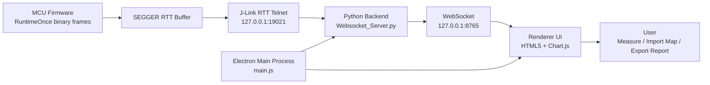

# Runtime Observer

[中文](README.md) | [English](README.en.md)

Runtime Observer 是一款面向嵌入式实时系统的桌面测量工具，用于通过 SEGGER J-Link RTT 采集 RuntimeOnce 数据，并以曲线、表格、快照和报告的形式观察 Task / Runnable 单次运行时间与 CPU 整体负载。

它适合用于嵌入式任务调度、Runnable 周期耗时、CPU 负载裕量和运行时间异常波动的快速观察。

## 项目简介

Runtime Observer 面向嵌入式实时系统的运行时间观测场景，桌面端负责启动和管理 Python 采集后端、J-Link GDB Server、RTT Telnet 链路，并通过 WebSocket 将采集数据推送到前端界面。

前端提供实时曲线、测量线、对象统计、CPU 负载窗口、快照和报告导出能力，方便在调试阶段快速判断任务或 Runnable 的耗时变化。

## 主要功能

- J-Link RTT RuntimeOnce 数据实时采集
- Task / Runnable 运行时间曲线显示
- 曲线缩放、跟随最新、复位视图和测量线
- Task / Runnable 枚举映射导入与记忆清除
- CPU 整体负载滑动窗口分析
- 启动预检查页面，显示连接过程与后端日志
- 接收日志浮动窗口，可拖动和关闭
- 快照记录与 CSV 导出
- 测试报告导出
- 退出桌面应用时清理相关后端与 J-Link 进程
- 隐藏启动 SEGGER J-Link GDB Server，减少桌面干扰

## 技术栈

| 模块 | 技术 |
| --- | --- |
| 桌面容器 | Electron |
| 前端界面 | HTML5 / CSS / JavaScript |
| 曲线绘制 | Chart.js |
| 后端采集 | Python WebSocket |
| 调试链路 | SEGGER J-Link RTT / J-Link GDB Server |
| 打包 | electron-builder |

## 架构设计



## 数据链路

```text
MCU RTT 二进制帧
  -> J-Link RTT Telnet
  -> Python WebSocket 后端
  -> Electron Renderer
  -> Chart.js 曲线 / 表格 / 报告
```

## 本地开发

安装依赖：

```powershell
npm install
```

启动桌面应用：

```powershell
npm start
```

打包 Windows 应用：

```powershell
npm run dist
```

## 使用说明

1. 确认本机已安装 SEGGER J-Link 工具链。
2. 启动 Runtime Observer。
3. 启动页会显示后端、J-Link、RTT、WebSocket 等连接步骤。
4. 进入主界面后，可观察 Task / Runnable 运行时间曲线与 CPU 负载。
5. 如需显示真实对象名，可通过菜单导入 Task / Runnable 映射文件。
6. 如需恢复原始对象名，可通过菜单执行“清除记忆”。

## 注意事项

- 工具依赖本机 SEGGER J-Link 环境。
- 映射文件记忆、布局记忆等保存在本地桌面应用环境中。

## 版本记录

### V1.1

发布时间：2026-07-06

#### 打包运行修复

- 修复 `npm run dist` 打包后 exe 启动时报“页面文件不存在”的问题。
- 将前端页面、图标等应用内资源改为通过 `app.getAppPath()` 读取，兼容 `app.asar` 打包结构。
- 将后端 Python 脚本与工具程序改为通过 `process.resourcesPath` 读取，确保外部进程可以在打包环境中正常访问。
- 将 `backend/` 加入 `electron-builder.extraResources`，打包后会复制到 `resources/backend/`。

#### 版本与发布信息

- 应用版本号从 `1.0.0` 升级到 `1.1.0`。
- 关于窗口版本显示更新为 `V1.1`。

#### 验证记录

- `main.js` 语法检查通过。
- `preload.js` 语法检查通过。
- 前端 HTML 内联脚本语法检查通过。
- `npm run dist` 打包验证通过。
- 打包后确认 `app.asar`、`resources/backend/Websocket_Server.py`、`resources/tools/Websocket_Server.exe` 均存在。
