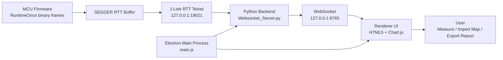

# Runtime Observer

> 运行时间观察与 CPU 负载测量工具  
> Runtime and CPU load measurement tool

Runtime Observer 是一款面向嵌入式实时系统的桌面测量工具，用于通过 SEGGER J-Link RTT 采集 RuntimeOnce 数据，并以曲线、表格、快照和报告的形式观察 Task / Runnable 单次运行时间与 CPU 整体负载。

Runtime Observer is a desktop measurement tool for embedded real-time systems. It collects RuntimeOnce data through SEGGER J-Link RTT and visualizes Task / Runnable execution time and overall CPU load with curves, tables, snapshots, and reports.

## 项目简介 / Overview

| 中文 | English |
| --- | --- |
| 面向嵌入式任务调度、Runnable 周期耗时、CPU 负载裕量和运行时间异常波动观测。 | Designed for observing task scheduling behavior, Runnable runtime, CPU load margin, and abnormal runtime fluctuations. |
| 支持启动预检查、实时曲线、负载分析、快照记录、测试报告导出和映射文件导入。 | Supports startup precheck, real-time curves, load analysis, snapshots, test report export, and mapping file import. |
| 桌面端会管理后端采集程序与 J-Link 相关进程，减少手动启动和清理成本。 | The desktop app manages the acquisition backend and J-Link related processes, reducing manual startup and cleanup work. |

## 主要功能 / Features

| 中文 | English |
| --- | --- |
| J-Link RTT RuntimeOnce 数据实时采集 | Real-time J-Link RTT RuntimeOnce acquisition |
| Task / Runnable 运行时间曲线显示 | Task / Runnable runtime curve visualization |
| 曲线缩放、跟随最新、复位视图和测量线 | Curve zooming, follow-latest mode, reset view, and measurement markers |
| Task / Runnable 枚举映射导入与记忆清除 | Task / Runnable enum mapping import and memory clearing |
| CPU 整体负载滑动窗口分析 | CPU load sliding-window analysis |
| 启动预检查页面，显示连接过程与后端日志 | Startup precheck page with connection steps and backend logs |
| 接收日志浮动窗口，可拖动和关闭 | Draggable floating receive-log panel |
| 快照记录与 CSV 导出 | Snapshot capture and CSV export |
| 测试报告导出 | Test report export |
| 退出桌面应用时清理相关后端与 J-Link 进程 | Backend and J-Link process cleanup when the desktop app exits |
| 隐藏启动 SEGGER J-Link GDB Server，减少桌面干扰 | Hidden SEGGER J-Link GDB Server startup for a cleaner desktop workflow |

## 技术栈 / Tech Stack

| 模块 | Layer | 技术 / Technology |
| --- | --- | --- |
| 桌面容器 | Desktop shell | Electron |
| 前端界面 | Frontend | HTML5 / CSS / JavaScript |
| 曲线绘制 | Charts | Chart.js |
| 后端采集 | Acquisition backend | Python WebSocket |
| 调试链路 | Debug link | SEGGER J-Link RTT / J-Link GDB Server |
| 打包 | Packaging | electron-builder |

## 架构设计 / Architecture



## 数据链路 / Data Flow

```text
MCU RTT 二进制帧 / MCU RTT binary frames
  -> J-Link RTT Telnet
  -> Python WebSocket 后端 / Python WebSocket backend
  -> Electron Renderer
  -> Chart.js 曲线、表格、报告 / Chart.js curves, tables, reports
```

## 本地开发 / Development

安装依赖 / Install dependencies:

```powershell
npm install
```

启动桌面应用 / Start the desktop app:

```powershell
npm start
```

打包 Windows 应用 / Build Windows artifacts:

```powershell
npm run dist
```

## 使用说明 / Usage

| 步骤 | 中文 | English |
| --- | --- | --- |
| 1 | 确认本机已安装 SEGGER J-Link 工具链。 | Make sure the SEGGER J-Link toolchain is installed locally. |
| 2 | 启动 Runtime Observer。 | Start Runtime Observer. |
| 3 | 启动页会显示后端、J-Link、RTT、WebSocket 等连接步骤。 | The startup page displays backend, J-Link, RTT, and WebSocket connection steps. |
| 4 | 进入主界面后，可观察 Task / Runnable 运行时间曲线与 CPU 负载。 | After entering the main view, observe Task / Runnable runtime curves and CPU load. |
| 5 | 如需显示真实对象名，可通过菜单导入 Task / Runnable 映射文件。 | Import Task / Runnable mapping files from the menu if object names are needed. |
| 6 | 如需恢复原始对象名，可通过菜单执行“清除记忆”。 | Use the memory clearing menu item to restore original object names. |

## 注意事项 / Notes

| 中文 | English |
| --- | --- |
| 工具依赖本机 SEGGER J-Link 环境。 | The tool depends on a local SEGGER J-Link environment. |
| 映射文件记忆、布局记忆等保存在本地桌面应用环境中。 | Mapping memory and layout memory are stored locally by the desktop app. |
